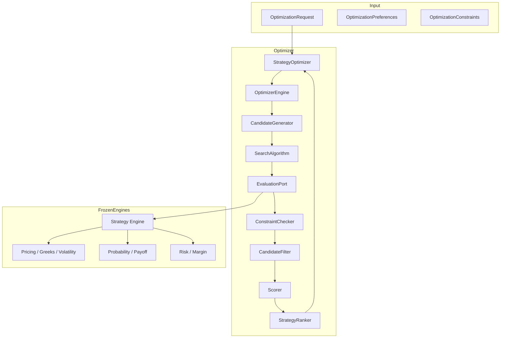

# Strategy Optimizer Architecture

## Layer Responsibilities

| Layer | Responsibility |
|-------|----------------|
| Generators | Assemble leg combinations (no math) |
| Search | Select candidate subset (brute force default) |
| Evaluation Port | Delegate to Strategy Engine |
| Constraints | Filter using engine outputs |
| Scoring | Map engine scores (no formulas) |
| Ranking | Order by overall score |

## SOLID Principles

- **Single Responsibility:** Each package has one concern
- **Open/Closed:** Search algorithms extensible via `SearchAlgorithm` port
- **Dependency Inversion:** `EvaluationPort` injects Strategy Engine
