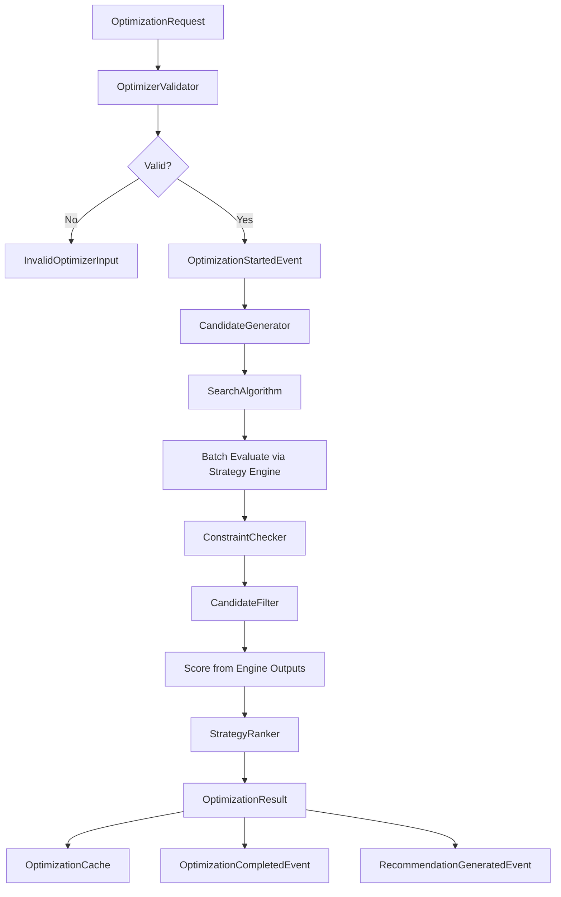

# Optimization Flow

## Pipeline Steps

1. **Validate** — context, preferences, market snapshot
2. **Generate** — candidate strategies from search space
3. **Search** — brute force (or future algorithm) selects subset
4. **Evaluate** — batch evaluate via Strategy Engine (frozen engines)
5. **Constrain** — filter by max loss, margin, POP, greeks limits
6. **Filter** — capital and liquidity filters
7. **Score** — map engine outputs to optimizer scores
8. **Rank** — Top 10/25/50/custom by overall score
9. **Recommend** — best candidate recommendation
10. **Cache & Publish** — store and emit events

## Search Space

| Category | Examples |
|----------|----------|
| Single Leg | Long/Short Call/Put |
| Vertical Spreads | Bull Call, Bear Put |
| Volatility | Straddle, Strangle |
| Range | Iron Condor |
| Templates | Built-in from Strategy Engine |

## Objectives

MAX POP, MAX Expected Return, MIN Risk, MIN Margin, MAX Theta, Delta Neutral, MIN Vega, MAX Capital Efficiency, MIN Drawdown

## Constraints

Max Loss, Max Margin, Min POP, Min Liquidity, Max Delta/Gamma/Vega, Max Position Size, Max Legs
