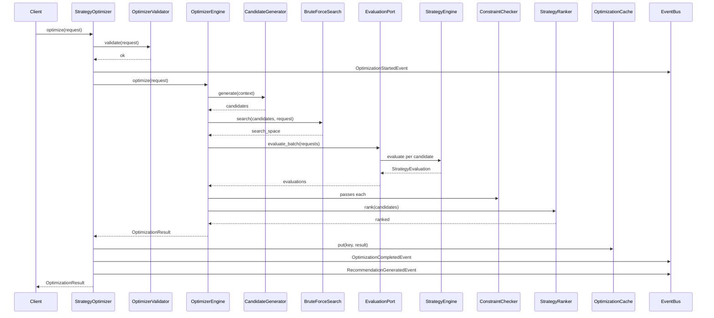

# Strategy Optimizer Sequence Diagram

## Batch Evaluation

The optimizer builds `StrategyEvaluationRequest` for each candidate and calls `evaluate_batch` on the evaluation port. The Strategy Engine orchestrates all frozen quantitative engines per candidate — the optimizer never performs calculations directly.
