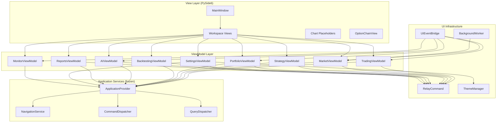
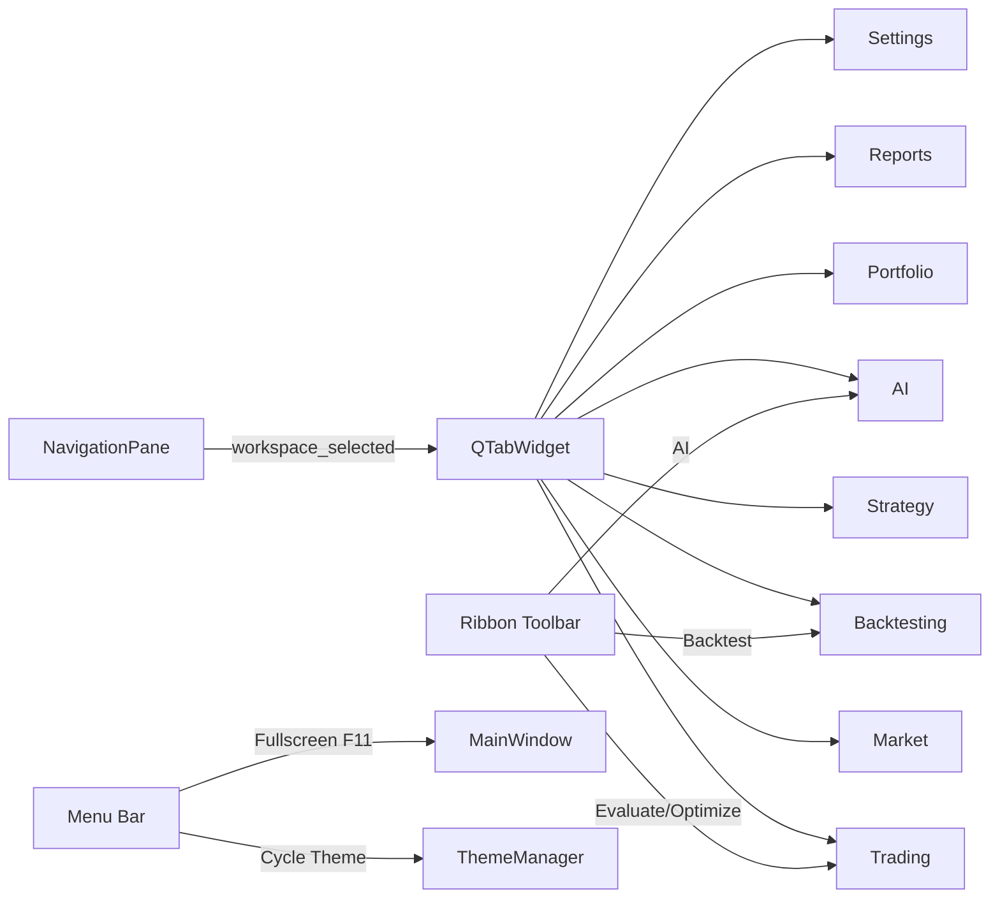
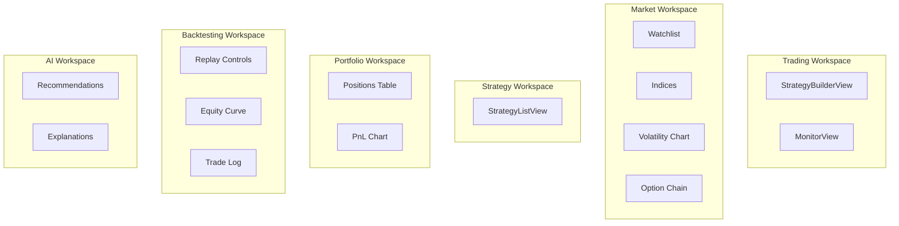
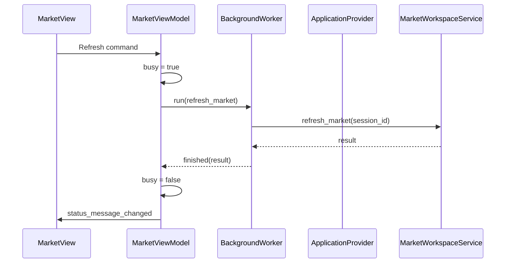

# UI Architecture Diagrams

## MVVM

```mermaid
flowchart TB
    subgraph ViewLayer["View Layer (PySide6)"]
        MW[MainWindow]
        WS[Workspace Views]
        CH[Chart Placeholders]
        OC[OptionChainView]
    end

    subgraph ViewModelLayer["ViewModel Layer"]
        TVM[TradingViewModel]
        MVM[MarketViewModel]
        SVM[StrategyViewModel]
        PVM[PortfolioViewModel]
        BVM[BacktestingViewModel]
        AVM[AIViewModel]
        RVM[ReportsViewModel]
        SetVM[SettingsViewModel]
        MonVM[MonitorViewModel]
    end

    subgraph UILayer["UI Infrastructure"]
        CMD[RelayCommand]
        BRG[UIEventBridge]
        WRK[BackgroundWorker]
        THM[ThemeManager]
    end

    subgraph AppLayer["Application Services (frozen)"]
        AP[ApplicationProvider]
        NAV[NavigationService]
        CMDS[CommandDispatcher]
        QRY[QueryDispatcher]
    end

    MW --> WS
    WS --> TVM & MVM & SVM & PVM & BVM & AVM & RVM & SetVM
    WS --> MonVM
    TVM & MVM & SVM & PVM & BVM & AVM & RVM & SetVM --> CMD
    TVM & MVM & SVM & PVM & BVM & AVM & RVM & SetVM --> AP
    MonVM --> AP
    BRG --> TVM & MVM & PVM & AVM & MonVM
    WRK --> MVM
    SetVM --> THM
    AP --> NAV & CMDS & QRY
```

## Navigation

```mermaid
flowchart LR
    NAV[NavigationPane] -->|workspace_selected| TABS[QTabWidget]
    TABS --> TR[Trading]
    TABS --> MK[Market]
    TABS --> ST[Strategy]
    TABS --> PF[Portfolio]
    TABS --> BT[Backtesting]
    TABS --> AI[AI]
    TABS --> RP[Reports]
    TABS --> SE[Settings]
    RIBBON[Ribbon Toolbar] -->|Evaluate/Optimize| TR
    RIBBON -->|Backtest| BT
    RIBBON -->|AI| AI
    MENU[Menu Bar] -->|Fullscreen F11| MW[MainWindow]
    MENU -->|Cycle Theme| THM[ThemeManager]
```

## Workspaces

```mermaid
flowchart TB
    subgraph TradingWS["Trading Workspace"]
        SB[StrategyBuilderView]
        MON[MonitorView]
    end

    subgraph MarketWS["Market Workspace"]
        WL[Watchlist]
        IDX[Indices]
        VOL[Volatility Chart]
        CHN[Option Chain]
    end

    subgraph StrategyWS["Strategy Workspace"]
        SL[StrategyListView]
    end

    subgraph PortfolioWS["Portfolio Workspace"]
        POS[Positions Table]
        PNL[PnL Chart]
    end

    subgraph BacktestWS["Backtesting Workspace"]
        RC[Replay Controls]
        EQ[Equity Curve]
        TL[Trade Log]
    end

    subgraph AIWS["AI Workspace"]
        REC[Recommendations]
        EXP[Explanations]
    end
```

## Sequence — Market Refresh

```mermaid
sequenceDiagram
    participant V as MarketView
    participant VM as MarketViewModel
    participant W as BackgroundWorker
    participant AP as ApplicationProvider
    participant S as MarketWorkspaceService

    V->>VM: Refresh command
    VM->>VM: busy = true
    VM->>W: run(refresh_market)
    W->>S: refresh_market(session_id)
    S-->>W: result
    W-->>VM: finished(result)
    VM->>VM: busy = false
    VM->>V: status_message_changed
```
